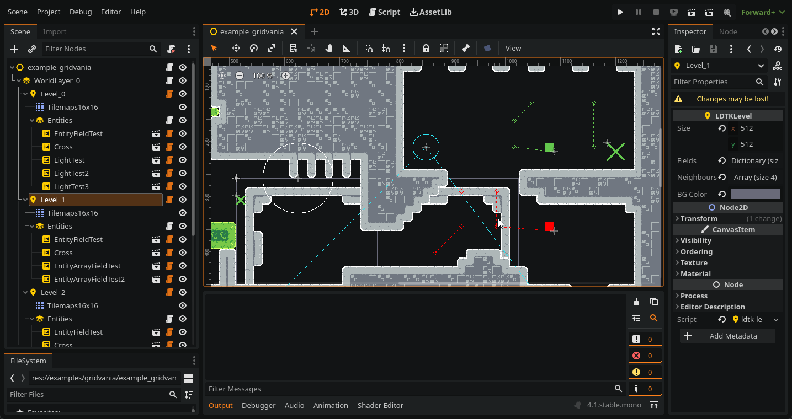
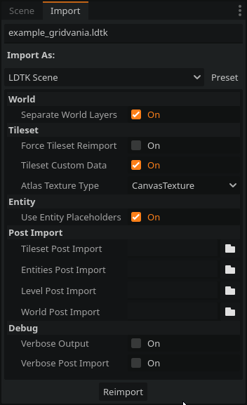

<p align="center">
	
</p>

# Godot LDtk Importer

[LDtk](https://ldtk.io/) importer plugin for [Godot 4](https://godotengine.org/)

 



# Quickstart

1. **[Download the latest release](https://github.com/heygleeson/godot-ldtk-importer/releases)**
2. Unpack `/ldtk-importer/` into the `/addons/` folder in your Godot project.
3. Enable this plugin in `Project > Project Settings > Plugins`
4. `.ldtk` files can now be opened in the Editor!

# ✨ Features

## 🌏 World
- Imports '.ldtk' files as Scenes
- Supports separating Levels by WorldDepth

## 🏔️ Level
- Imports level background images
- Parses Level Fields into Godot types
- Supports external levels

## 📄 Layer
- Generates TileMaps from all LDtk tile layer types (Tiles, IntGrid, AutoLayer)
- Supports LDtk Tilemap layers of different grid sizes
- EntityLayers store an array of Entities, to be handled later (by Placeholders or a Post-Import script)

## 🧱 Tilesets
- Generates Atlases from LDtk Tilesets
- **Supports flipped tiles**
- Supports importing as *CanvasTextures*, allowing for usage of normal maps.
- Allows for further editing of TileSets in the Editor, preserving changes (Physics Layers, Render Layers, etc.)
- Supports [Tile Custom Data](#-tile-custom-data)

## 🐸 Entities
- Creates placeholder `LDTKEntity` nodes.
- Parses Entity Fields into Godot types
- **Handles EntityRefs**

# 🚩 Import Options 



With the `.ldtk` file selected in `FileViewer`, go to the `Import` dock to view the following import options:

- **World**
	- **Separate World Layers**: *Group levels into `LDTKWorldLayer` nodes, sorted by `worldDepth`.
- **Tileset**
	- **Force Tileset Reimport**: *Ignore existing TileSets and generate new ones.*
	- **Tileset Custom Data**: *Add tile custom data (see [Tile Custom Data](#-tile-custom-data))*
	- **Atlas Texture Type**: *CompressedTexture2D or CanvasTexture*
- **Entity**
	- **Use Entity Placeholders**: *Create `LDTKEntity` nodes that emulate entities inside LDTK.*
- **Post Import**
	- **Tileset Post Import**: *Attach script (see [Post-Import](#-post-import))*
	- **Entity Post Import**: *Attach script (see [Post-Import](#-post-import))*
	- **Level Post Import**: *Attach script (see [Post-Import](#-post-import))*
	- **World Post Import**: *Attach script (see [Post-Import](#-post-import))*
	
## 🧩 Tile Custom Data

LDtk allows you to add custom data to individual tiles in any given tileset.

> This data can either be numbers, text, JSON, XML, etc. Basically, any tile related info you would like to pass to your game engine.

If the import option `Tileset Custom Data` is selected, a Custom Data Layer is added and the data is stored on the tile as a `String`. If you need to further parse your tile data, write a Tileset Post-Import script.

# 🔧 Post-Import

You can hook up custom scripts that run during importing that further modify the resulting Scene/Resource.

Currently, there are **four** points where a post-import script can be inserted, in order of execution:
- **TileSet:** supplies an Array of generated TileSets
- **Entity:** supplies a *LDTKEntityLayer* containing the layer definition and entities.
- **Level:** supplies a *LDTKLevel* node containing *TileMaps*, *Backgrounds(Sprite2D)* and *LDTKEntityLayer* nodes.
- **World:** supplies the *LDTKWorld* containing all *LDTKLevel* nodes.

Example post-import scripts are included to cover common use cases; feel free to edit/expand on them to suit your project.

### Post-Import: Tilesets
```gdscript
@tool

func post_import(tilesets: Dictionary) -> Dictionary:
    # Behaviour goes here

    return tilesets
```

### Post-Import: Entity Layer
```gdscript
@tool

func post_import(entity_layer: LDTKEntityLayer) -> LDTKEntityLayer:
    var definition: Dictionary = entity_layer.definition
    var entities: Array = entity_layer.entities
    for entity in entities:
        # Perform operations here
        pass

    return entity_layer
```

### Post-Import: Level
```gdscript
@tool

func post_import(level: LDTKLevel) -> LDTKLevel:
    # Behaviour goes here

    return level
```

### Post-Import: World
```gdscript
@tool

func post_import(world: LDTKWorld) -> LDTKWorld:
    # Behaviour goes here

    return world
```

# ❓FAQ

## How do I add tileset collisions?

While it is possible to add tileset collisions via a post-import script, this plugin is designed so that it is easy to manually edit the generated TileSets inside the project directly - reimporting the LDtk file will preserve these changes.

1. Open the generated TileSet (e.g. `tilesets/tileset16x16.res`)
2. In the Inspector, add a Physics Layer
3. In the `TileSet` pane, select the `TileSetAtlasSource` and go to the `Select` view.
4. Open the `Physics` submenu and select the created `Physics Layer`.
4. Add collision polygons to each individual tile as necessary

> TIP: A quick way to do this is to click+drag to select multiple tiles, and press F to use the default tile shape.

## How do I add tilemap normals?

1. Under `Import Options`, make sure you have selected `Atlas Texture Type` to `Canvas Texture`
2. Open the generated TileSet (e.g. `tilesets/tileset16x16.res`)
3. In the `Tileset` pane, select the `TileSetAtlasSource` go to the `Setup` view
4. Select `Texture`, and add the corresponding normal map.

## How do EntityRefs work when I want to use my own nodes?

This was quite tricky to get right, and still needs some testing! I might expand this into its own section, but it's probably best if I explain how these are currently handled by the importer.

LDTK uses instance ids to refer to unique instances of levels, entities, etc. They look this:
```json
{
    "iid": "c27f1f10-3b70-11ee-8b24-732c4cff2bf2"
}
```

There are two things to consider when converting the JSON into a scene:
1. The node that the **iid** should point to. (`instance_references`)
2. Fields that contain an **iid**, which should point to the node that belongs to it. (`unresolved_references`)

EntityRef fields are *unresolved* when they are encountered by the importer, because the node it points to might not exist yet (e.g. an entity from Level_1 may point to an entity in Level_2).

To solve this, this LDTK importer provides utility functions for you to add/update these references, which the importer will then try to resolve them *after all the post-import scripts have run*, before saving the scene. 

These functions are:

- `update_instance_reference(iid, scene)`
- `add_unresolved_reference(scene, property_name)`

Check out the following Entity Post-Import script to see how they are used:
```gdscript
@tool

## Entity Post Import Example, showcasing how to handle EntityRefs.

const Util = preload("res://addons/ldtk-importer/src/util/util.gd")
const SceneTest = preload("res://node_test.tscn")

func post_import(entity_layer: LDTKEntityLayer) -> LDTKEntityLayer:
    var entities: Array = entity_layer.entities
    for entity in entities:
        # Create entity node (simple example)
        var scene = SceneTest.instantiate()
        entity_layer.add_child(scene)

        # Update 'iid' to reference this entity node
        Util.update_instance_reference(entity.iid, scene)

        # Add unresolved reference (e.g. EntityRef field)
        if "Entity_ref" in entity.fields:
            var ref = entity.fields.Entity_ref
            if ref != null:
                scene.ref = ref
                Util.add_unresolved_reference(scene, "ref")

    return entity_layer
```

Here is the example **SceneTest** scene:
```gdscript
@tool
extends Node2D

@export var ref: NodePath # The EntityRef we are updating via post-import
```

> The entity scene holding an EntityRef variable must have the `@tool` annotation in its attached script, otherwise variables cannot be updated this way in the Editor.

If you run into any problems, please file an [issue](https://github.com/heygleeson/godot-ldtk-importer/issues)!

# 🫂 Special Thanks
- [amano-ldtk](https://github.com/afk-mario/amano-ldtk-importer) for original inspiration
- [Cammin](https://github.com/Cammin/LDtkToUnity) for helpful feedback!
